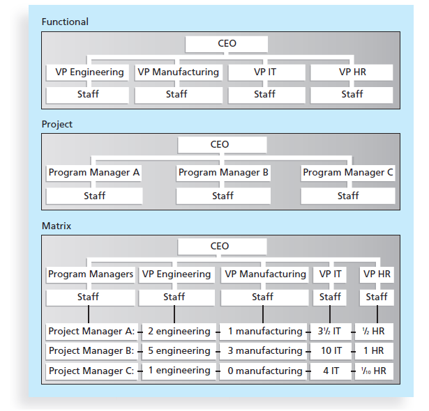

# Software Management

## Chapter 1 -Introduction to Software Management (Week 1)

## What is a project?

- Temporary endeavour to create a unique product/service to achieve a specific goal.

- Projects end when objectives/goals are met **OR** when project is terminated.

### Project attributes

- Has a unique goal
- Is temporary
- Requires resources (Human)

### Project Management

- Applying the **knowledge,skills and techniques to project activites** to meet requirements

- Managers try to meet **3 constraints** (project scope, time and cost)

1) Project scope
2) Time
3) Cost

**10 key knowledge areas:**

| Scope Management       | Schedule Management            |
|------------------------|--------------------------------|
| Cost Management        | Quality Management             |
| Risk Management        | Procurement Management         |
| Stakeholder Management | Project Integration Management |

- Knowledge areas describe key **compentencies** that project manager must develop

### Defining Project Success

- When project meets scope,time and cost goals

- Customer satisfied with product of project

- When project achives its specific goals (roi for example)

## Programs

- Are a group of **related** projects managed in a coordinated way

- E.g : Infrastructure, application dev, user support

## Project Portfolio Management

- Project portfolio management **involves organizing and managing projects and programs**as a portfolio of investments

- Portfolio managers help select and analyze projects from a strategic point **(Strategic & Tactical goals)**

# Chapter 2 - Project Management & IT Context

## Systems Approach to P.M

Projects must operate in a broad organization environment (to be able to handle complex situations)

* Needs a **holistic view** of a project and how it relates to the organization.
    * **Systems thinking** is used to describe this holistic view

### Systems Approach

Describes a **holistical and analytical** approach to management and problem solving

#### Importance
* Critical to sucessful project management as each part can be used to identify how projects relate to the whole organization

3 Parts: 
* **Systems Philosophy** 
    * Overall model for thinking of things as systems
* **Systems Analysis**
    * Problem-solving approach
        * Requires defining scopem, divide system into components, then identify and evaluate problems,constraints & opportunities
* **Systems Management** 
    * Addresses **business,technological,organization issues** that arise from creating,maintaining,modifying a system.

### 3 Spheres Model for systems management
1) Organization 
    * How will the particular project affect students / Who will develop it etc etc 
2) Business
    * What will the costs of the project be 
    * What will it cost the users?
3) Technology
    * What hardware is required for the project
    * Will additional technlogy be required for this?

## Understanding organizations

* Systems approach requires project managers to always view their projects in the context of the larger organization
* Organization al issues are the **most difficult** part of working & managing projects

Why understand organizations?
* To improve success rate of projects, project managers must understand both people and organizations 

    
### 4 Frames of Organizations

| Frames                                                 | Description                                                                                                                      |
|--------------------------------------------------------|----------------------------------------------------------------------------------------------------------------------------------|
| Structural frame (how it is structured)                | Describes **roles & responsibilities**, coordination and control. Organizational charts help describe this frame.                |
| Human resources frame                                  | Provides **harmony between needs of organization and its people**                                                                |
| Political frame (Organizational and personal politics) | Organizations are composed of varied individuals with different interests. Conflict and power are key issues                     |
| Symbolic frame (symbols & meanings)                    | Relates to symbols and meanings realated to an event. e.g: CEO coming in to personally kick start a project (What does it mean?) |

### Organizational Structures

3 Structures
1) Functional (hierarchical)
    * Specialised functional managers  & vice presidents in their own fields report to a higher up (CEO)
    * Their own staff are specialized in their various discipline

2) Project
    * Project managers report to the CEO instead 
    * Their staff have a variety of skills to complete a project
    * Revenue is gained by performing projects for other groups under a contract

3) Matrix 
    * Middle ground between Functional and project 
    * Staff report to both functional managers & project managers

### Focusing on Stakeholder's needs

Project managers must **identify,understand & manage relationships** with all project stakeholders

*Senior executives and top management are very important stakeholders

This can be done by: 
* Using 4 frames of organizations  to meet their needs & expectations

### Importance of Top Management Commitment

Many projects will fail without top level mangement commitment

* **Champion**  Someone who is a key proponent for a project

Top management can help project managers by:

* Providing adequate resources
* Approving unique project needs in a timely manner
* Getting cooperation from other parts of the organzation
* **Mentoring and coaching** on leadership issues

## Project & Product Life cycle 

Projects & Devloping products should be divided into several phases 
* Because projects operate as part of a system and involve uncertainty

### Project Life Cycle 
* Collection of project phases definining: 
    * What work will be done in each phase
    * What & when deliverables will be produced
    * Who is involved in each phase 
    * How management will control & approve work produced in each phase
* **Deliverable** is a product/service produced/provided as part of a project

**Early phase** of life cycle:

* Resource needs are usually lowest
* Level of risk is **highest**
* Stakeholders have the most influence on project

**Middle phase** of life cycle:

* Certainty of completing project **improves**
* More resources are needed

**Final phase** of life cycle:

* **Ensuring** that project requirements were met
* Sponsor approves completion of the project

### Product Life Cycle

**SYSTEMS DEVELOPMENT LIFE CYCLE** (SDLC)

* Framework for describing phases of developing information systems

* Popular models of SDLC:
    * Predictive life cycle
    * Iterative life cycle 
    * Incremental life cycle
    * Adaptive life cycle
    * Hybrid life cycle 

These models are examples of a **predictive life cycle** 

**Predictive life cycle**: 
* **Scope of project can be described clearly and schedule & cost can be predicted accurately.** 

Examples of predictive life cycle models
1) Waterfall model 
    * Well defined, linear stages of system development & support
2) Spiral model (improvement on waterfall)
    * Software is developed using **iterative/spiral approach** instead of a linear approach
    * Suitable to incorporate changes
3) Prototyping model
    * Used for developing prototypes to clarify user requirements
4) Rapid Application Development (RAD) model:
    * To produce systems quickly without sacrificing quality

## I.T project context

Project context 
    * Impaacts which product developement life cycle will be the most effective for a software development project

### I.T Projects

* Can support many industries and businesses 

I.T projects can be very diverse in:
* Size 
* Complexity 
* Products produced
* Application area 
* Resource Requirements

Factors affecting IT project management include:

1) Globalization 
    * Integration between people/companies internationally
2) Outsourcing
3) Virtual teams
4) Agile project management
    * Iterative development method where the requirements and solutions are constantly evolvling through collaboration with stalkholeders and project members
    * Process:
        * Individuals and interactions over processes & tools
        * Working software over comprehensive documentation 
        * Customer collaboration over contract negotiation 
        * Responsing to change over following a set plan

# Chapter 3 - Project Management Process Groups

Project Management knowledge areas

1) Integration
2) Scope
3) Cost
4) Quality
5) Resource
6) Communications
7) Risk
8) Procurement
9) Stakeholder Management

Projects involve **5 project management process groups** 

1) Iniatiting processes
    *   Defining and authorizing a project 
2) Planning processes
    * Planning what work must be done to ensure a project fulfills an organization's needs
3) Executing processes
    * Coordinating resources and people to create a product/services
4) Monitoring & Controlling processes
    * Measure progress of project against its objectives
5) Closing processes
    * Finalizing acceptance of a project and concluding it

## I.T Project Management Methodology 
Methodology 
* Describes **how things should be done**
Standard
* Describes **what should be done to manage a project**

Example methodology

## JWD Consulting (Predictive Approach)

### Project Pre-Initiation & Initiation 

Initiation  = Recognizing and starting a new project

* Must ensure that proper projects are started for the right reasons
    * This is done using **strategic planning** (to decide which projects to pursue)
    * Strategic plan defines organization's vision,mission goals,objectives and strategies

Pre Initiation

* Laying the groundwork of a project before starting it
* Pre-initiation tasks include 
    * Determine **scope,time,cost** constraints for project
    * Identify project sponsor
    * Selecting project amnager
    * Develop business case for project
    * Meet with project manager to review process & exepectations
    * Determine if project should be subdivided into smaller projects

## Project Planning

Main purpose : **To guide project execution**
Key outputs from project planning include:

* Team contract
* Project scope statement
* Work breakdown structure (WBS)
* Project schedule (Gantt Chart)
* List of prioritized risks 
    * Securit, efficiency, realizing benefits after a year

## Project Execution

Execution of project involves taking necessary actions to complete the activities set in project plan

* Products are then created in the project execution stage 
    * Project managers must handle challenges that occur with their leadership skills
    * Stakeholders focus on deliverables related to the product/service/outcome of a project
    * Change requests must also be documented and documentation must be updated

To track milestones, a **milestone report** can help

## Project Monitoring & Controlling

* **Measuring progress** of project and any delays in the project, and taking action to correct them.
* Outputs from this process group:
    * Performance reports
    * Change requests 
    * Updates to plans

## Project Closing

Maing idea : **Gaining stakeholder's/customer's opinions and acceptance** towards final product/service of project
* Outputs from this process group:
    * Final project report 
    * Presentations
    * Contract files
    * Lesson-learned reports

# Chapter 4 - Project Integration Management    

Coordination of all project management knowledge areas throughout a project's life cycle
* To ensure that all elements of a project come together resulting in a complete project

**6 Main Processes:**

1) Developing Project Charter
    * Working with stakeholders to create a document that **formally authorizes a project** **(project charter)**
2) Developing Project Management Plan
    * Coordinating planning efforts to create a coherrent document
3) Directing & Managing Project Work
    * Carrying out management plan by performing activities included in it.
    * Outputs in deliverables
4) Monitoring & Controlling Project Work
    * Overseeing actitivies to **meet performance objectives** of the project
5) Perform Integrated Change Control
    * **Identifying,evaluation & managing changes** throghout project life cycle
6) Closing project
    * Finalizing all project activities to formall close project

## Strategic Planning & Project Selection 

Determining long-term objective of an organizaiton
* Analzye strength & weaknesses
* Studying opportunities & threats in business environment
* Predict future trends 
* Projecting needs for new products & services
 
**Swot Analysis** (Strengths, Weaknesses, Opportunities & Threats)

**Identifying potential projects** (Starting project initiation)

**Aligning IT with business strategy** (IT Strategy Planning)

* Organizations must strategize using IT to support their own objectives and goals

I.T project selection process 

| Planning Stages        | Results Produced                                                                      |
|------------------------|---------------------------------------------------------------------------------------|
| I.T Strategy Planning  | Tie I.T strategy to mission & vision of organization. **Identify key business areas** |
| Business Area Analysis | **Document key business processes** that could benefit from I.T                       |
| Project Planning       | Define potential projects, project scope, benefits & constraints                      |
| Resource Allocation    | Select I.T Projects & Assign resources                                                |

## Methods for Selecting Projects 

Potential projects must be narrowed down and then selected by : 

* **Focusing on broad organizational needs**
    * Projects fullfiling broad organizational needs are more likely to be sucessful 
        * E.g: Improve safety/increase morale

* **Categorizing I.T projets**
    * Respondin to a problem / opportunity / directive
    * How long the project will take to do and its deadlines
    * Overall priority of a project
        
* **Performing financial analyses**
    * Very important regardless of current economics
    * Methods: 
        * Net present value (NPV) analysis **(Best financing tools)**
            * Calculate **expected net monetary gain/loss** from a project 
                * By discounting expected future cash inflow (cash come in) & outflow to present point of time 
            * Projects with **positive NPV** are prefered
        * Return of investment (ROI)
            * Precentage of return based on initial investment (Higher the better)
        * Payback analysis
            * Analysis for how long it will take to recoup the initial cost invested in a project

* **Use a weighted scoring model**
    * Systematic process for selecting projects based on many criterias
        * Identify criteria important to project selection process 
        * Assign weights to each criteria (percentages)
        * Assign scores to each criteria for each project
        * Multiple scores to get total weighted scores

* **Implement balance scorecard**
    * Approach to help select & Manage process that aligns with business activities to strategy, improve communications & monitor performance against strategic growth

## Project Charter & Project Management Plan 

### Project Charter 

* Document used to **formally authorizes a project and provides directions towards the projects objectives and management**
* Key stakeholders should be involed to acknowledge the need and intent of a project

### Project Management Plan

* Document used to coordinate all **project planning documents and help guide project execution & control**
    * Elements 
        * Overview of the project
        * Descripton of project's organization 
        * Management & technical processes used
        * Work to be done
        * Schedule & Budget info 
        * References to other project planning documents

# Chapter 5- Project Scope Management

**Scope** = Work Involved in creating a product of a project & the processes used to create it

* **Deliverable product** is a product produced as a result of a project (e.g: hardware,software, planning documents, meeting minutes)

Project Scope Management is the process of **defining & controlling** what work is done in a project

* Ensures same understanding of the end product and the processes used to create it for stakholders & project members

## Project Scope Management Processes
**Important**

1) Planning Scope Management
    * Determining how project's scope & requirements will be **managed**

2) Collecting requirements
    * Define & Document features and functions the pdocut will be produced with & processes used to make product

3) Defining scope
    * Review scope management plan, project charter,requirements,documents to create a scope statement. 
    * More requirements are developed as change requests are approved

4) Creating the WBS (Work breakdown structure)
    * Separating major project deliverables into smaller, managable sub components

5) Validating Scope
    * Formalizing acceptance of project deliverables

6) Controlling Scope
    * Control changes to a project scope throughout project life cycle

## Plannning Scope Management 

* Expert judgement, data analysis is used to develop:
    * Scope management plan
    * Requirements management plan
        * **Requirements = condition / capability needed by a user to solve a problem**

Scope Management Plan Content

* How to prepare detailed project scope statement
* How to create WBS
* Maintain & Approve WBS 
* Formal acceptance of completed project deliverables
* Controlling change requests

Requirements Management Plan Content
* How to plan,track & report requirements activities
* How to perform configuration management activities
* How to prioritize requirements

## Collecting Requirements

Method of collecting:

1) Interview stakeholders
2) Use focus groups
3) Questionnaires & surveys
4) Observational studies

* Requirements traceability matrix (RTM): a table that lists requirements, various attributes of each requirement, and the status of the requirements to ensure that all requirements are addressed

## Defining Scope

Good scope definition helps improve **accuracy of time,cost & resource estimates**

Project scope statements should include

* Product scope description
* Product user acceptance criteria 
* Detailed info on all project deliverables

Should also document other scope-related info
* Project boundaries, constraints & assumptions

## Creating the WBS 

* Deliverable-oriented grouping of work involved in a project that **defines total scope of project**
    * Foundation program for providing the basis of planning & managing project schedules, costs, resources and changes

* Decomposition is the main technique used (subdividing)

## Validating & Controlling Scope

Projects (Especially I.T suffer from scope creep)

**Validating**

* Formal acceptance of completed project delievrables
    * Achieved by customer inspection and then signed-off on key deliverables

**Controlling Scope**

Involves controlling changes to project scope
* Keep project goals & business strategy in mind

Goals of scope control are: 
* Manage changes when they occur
* Ensure changes are processed with the apropriate procedures

# Chapter 6- Project Time Management

Project schedule problems are usually due to time constraints and differences in both work styles & culture.

## Project Time Management Process

1) Planning Schedule Management
    * Determining policies, procedures & documentation to be used for planning,executing & controlling project schedule

2) Defining activities
    * Identifying specific activities that each porjec member & stakeholder must perform to product a project deliverable
        * A project **milestone** has no set duration

3) Sequencing activities
    * Identifying & documenting relationship between project activities

4) Estimating activitiy resources (with network diagrams)
    * Estimating how many resources is needed to perform project activities

5) Estimating activity durations
    * Estimating number of work periods needed to complete activities

6) Developing Schedule
    * Create project schedule using activity sequences, resource estimates & duration (Process 3&4&5)
    * Tools & Techniques 
        * Gantt Charts
        * Critical path analysis
        * Critical chain scheduling

7) Controlling Schedule
    * Controlling & managing changes to the project schedule

## Planning Schedule Management

Elements of a schedule management plan: 

1) Project schedule model development
2) Scheduling methodology
3) Level of accuracy and units of measure
4) Control thresholds
5) Rules of performance measurement
6) Reporting formats
7) Process descriptions

# Chapter 7 - Project Cost Management

Cost = resource used to achieve a specific objective

Project Cost Management
* Process to ensure project is **completed within an approved budget**

## Basic Principles of Cost management

Profits:

* Revenue minus expenditures

Profit margin: 

* Ratio of profits to revenues

Life cycle costs: 
* Overview of the cost of a project throughout its life cycle

Cash flow anlysis: 
* Estimated annual costs and benefits and annual cash flow of a project

### Types of Costs & Benefits: 

Tangible: 

* Costs / benefits easily measurable in dollars

Intangible:

* Costs / benefits difficult to measure in dollars

**To determine how well an ogranizaiton can define estimated costs / benefits** 

Direct: 

* Costs related to products products/services of a project
* Salaries, costs of hardware/software

Indirec: 

* Costs indirectly related to working on project but not directly on products/services
* Electricity, rental etc

Sunk costs

* Money already invested into projects
    * Usually failing projecst. Should be ignored and moved on from

### Additional Concepts

Learning curve theory

* Unit cost of repetitivly produced items decreases linearly as more units are producerd

Reserves

* Dollars included in cost estimate to mitigate cost risk by preparing for situations that are difficult to predict
    * Contingency Reserves
    * Management Reserves

## Project Cost Management Processes 

1) Planning Cost Management
    * Determining polcicies, procedures & documentation used for planning, executing &controlling project cost

2) Estimating costs
    * Developing an estimate of costs of resources needed to complete a project.
    * 3 Types
        * Rough order of magnitude (ROM)- very early in project
        * Budgetary - Midway project
        * Definitive - Later on in project

3) Determining the budget
    * Allocation of cost estimate to individual items to **establish baseline for measuring performance**

4) Controlling Costs
    * Controlling changes to project budget
    * Done by using **EVM**

## Earned Value Management (Controlling Costs)

Measures performance of a project by integrating **scope,time, & cost data**

3 values to calculate

1) Planned Value (PV) 
    * **AKA BUDGET** is the approved total cost estimate of an activity 

2) Actual Cost (AC)
    * **Total direct & indirect costs** inccured on work in an actvity 

3) Earned Value (EV)
    * Estimate of value of actual work done

# Chapter 8 - Project Quality Management

* To ensure project will satisfy the needs that have been set

Quality refers to:

A degree of which a set of inherrent characteristics fulfils requirements 

OR 

Conformance to requirements

* How does the product of a project meet written specificaitons 

Fitness for use

* How suitable it is to use as intended

## Project Quality Management Processes 

Processes

1) Planning Quality Management 
    * **Identifying which quality standards are relevant & and how satisfy them**

2) Managing Quality (Performing quality assurance)
    * **Evaluating overall project performance** to ensure that it satisfy quality standards

3) Controlling Quality
    * **Monitoring outcome of a project** to satisfy quality standards
    * Acceptance decisions
    * Rework
    * Process adjustments

### Managing Quality (Quality Assurance)

* To satisfy relevant quality standards of a project

**Terms for quality assuarance**

1) Kaizen (Improvement)
2) Lean (Evaluating processes to maximize customer value whilst minimalizing waste)

**Tools for performing quality assurance**

1) Benchmarking
    * Compares a project / product characteristics to others to generate ideas to improve quality

2) Quality Audit
    * Helps identify lessons learned to then improve performance on current/future projects

## Tools & Techniques for Quality Control

1) Cause-and-effect diagrams
    * Trace complaints back to the responsible product
2) Control chart
3) Checksheet
4) Scatter digram
5) Histogram
5) Pareto chart
6) Flowchart

## Testing

Testing must be done at every stage of SDLC

Types of Tests: 

1) Unit Testing
    * Tests each individual component
2) Integration Testing 
    * Tests functionally grouped component
3) System testing
    * Tests entire system as a whole
4) User acceptance testing 
    * Testing performed by end users just before accepting the final system

## Improving I.T Project Quality

* Establish good leadership that promotes quality
* Understand cost of quality
* Provide good workplace to enchance quality 
* Improve overall maturity level in software development and project managements

## Maturity Models

- Framework for helping organizations improve their processses & systems
