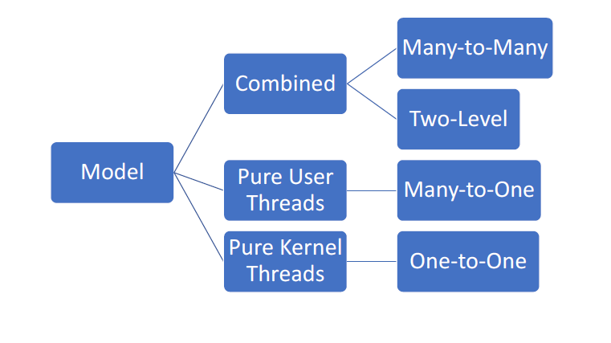
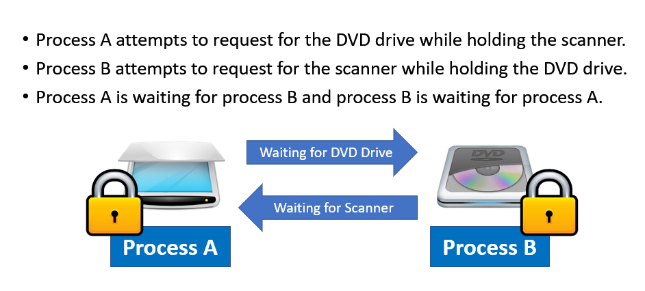
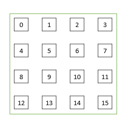
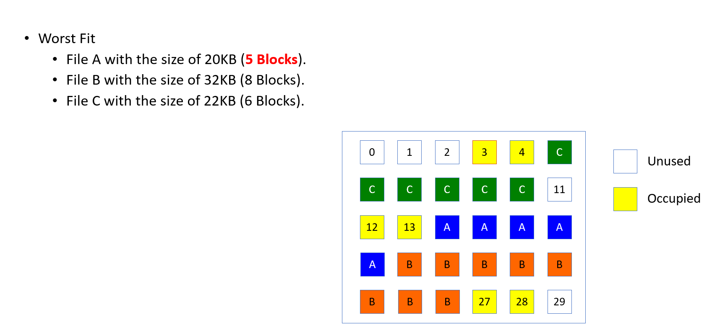
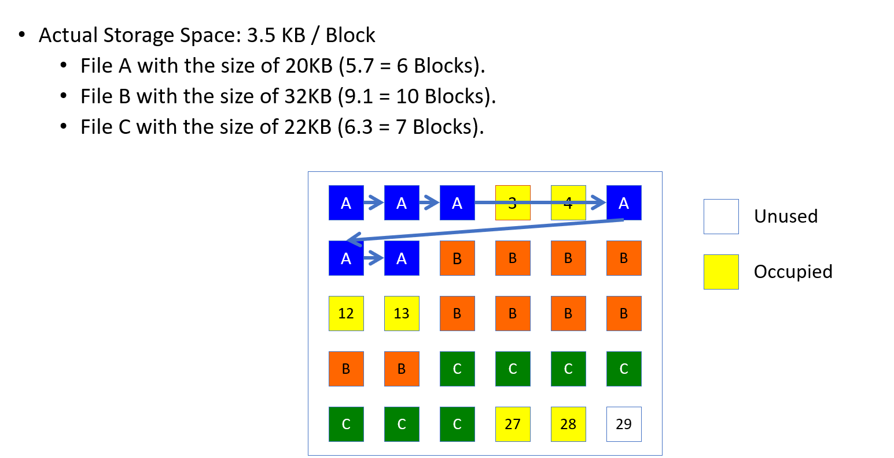

# Chapter 2 - Process Concept

## Process

* Program in execution (Running state)
* Program becomes process after:
    1) Exe file is loaded into memory
    2) Tasks to prep exe file to run is done

### Process State 

1) New: Process is being created
2) Ready: Process waiting to be assigned to processor
3) Running: Instructions (of process) are being executed
4) Waiting: Process waiting for some events to occur
5) Terminated: Process finished execution

**Only 1 process can be in running state for 1 processing core**  
**If >1 cores, then >1 processes in running state for each core**

Process contains other info:

* Text
    - Program code
    - Register's contents
    - Current activity
* Stack (LIFO)
    - Temporary data
* Data
    - Global variables 
* Heap
    - Memory dynamically allocated during execution

| Stack |
|-------|
|       |
|       |
| heap  |
| data  |
| text  |

## Managing & Identifying large no. of processes 

Using the **Process Control Block (PCB)**

* Each process is **identified by a PCB** (PCB has a unique Process Identifier (PID))
* PCB is created & managed by OS

## Process Management

Is needed to (for 1 CPU/Processing core):
1) Improve cpu utilization (Keep CPU busy at all times)
2) Ensure each process can be executed

### Process Management Techniques 

**Multi-Programming**

* To ensure CPU always has process to execute
* **Main Idea**: Switch to another process(sitting in memory) when **current one** has entered waiting state

* However, some running process might not enter the waiting state / not finish execution **USE TIME-SHARING**

**Time-Sharing**

Switch processes frequently(every 10ms), As switching is fast, users can interact with each process while it is running

### Multi-programming vs. Time-sharing

* Both tehcniques are used to allow the CPU to handle multiple processes running at the same time
* Multi-programming selects a processe and assigns CPU to it, then switches when current one is in the waiting state. Users are only allowed to interact with the current running process.

Main difference between multiprogramming and time sharing is that multiprogramming is the effective utilization of CPU time, by allowing several programs to use the CPU at the same time but time sharing is the sharing of a computing facility by several users that want to use the same facility at the same time.

##Context Switch (switching of one process to another)

Context Switching involves storing the context or state of a process so that it can be reloaded when required and execution can be resumed from the same point as earlier. This is a feature of a multitasking operating system and allows a single CPU to be shared by multiple processes.

Switching from old process -> new 
* OS saves the state (Context data )
* OS then loads the saved state of new process 

Time taken to perform context switch = **overhead** (no other processes are done during context switch)

## Process Creation & Termination 

### Process Creation 

1) Assign uniqiue PID to new process

## Chapter 3

## Implementation of OS, Virtualization and System Generation

### A) Implementation of OS

* Written in high level programming language
    * Easier to debug,port,understand
    * Code can be writen faster

### B) OS & Kernel

### Kernel

* Has to be **loaded first** into **main memory** when computer is started
    * This is known as **booting**

A bootstrap program (small code) **locates** kernel and **loads** it into main memory then **starts execution**.

 Properties

>  * Core of an OS
> * **Does not** interact directly with users
> * Focus on interacting with **hardware**
> * Provides services to other parts of OS

### C) System Structure

* Refers to kernel's structure
    * How to structure components in a kernal 
* System structure can affect aspects of an OS:
    * Performance
    * Stability
    * Debugging & Maintenance
    * Enhancements

### System structure (Monolithic & Microkernel)

* Kernel has these components:

| Components            |
|-----------------------|
| Process Scheduling    |
| Memory Management     |
| Device Drivers        |
| File System           |
| Communication         |
| Other system services |
To structure these components:

* Monolithic and Microkernel

#### Monolithic

* Single large program
* Each procedure free to call others
* All procedures sit in **kernel** space
    * Memory space occupied by kernel
    * Protected area (not overwrittable)
    * Kernel performs process execution in kernel space

#### Microkernel

* Removes non-essential components form the kernel
* Implements as **kernel & user programs**

**Advantages** of Microkernel are:

* Reduces chances of kernel crash by **reducing components running in user space**

* Crashing programs(user space) will not affect kernel

Main Function of the kernel:
* Manages **interprocess communications** between **programs and various services** that are running in **user space**

This is done using 2 methods: **Shared Memory** and **Message Passing**

### Modules / Modular kernel

Creates a modular kernel where each module is **seperated** and **dynamically loadable as needed**

* Can communicate with each other via an interface
* Dynamically loadable as needed

### Hybrid Kernel

A Hybrid of **monolithic and microkernel**. Considered less bulky than monolithic

Removes certain components but not as much as microkernel. E.G: device drivers are still present in kernel

### C) Virtualization

### Hardware Virtualization

Framework for **dividing resources** of a computer into **multiple execution environemnts**

* Allows for a separate execution environment ot run on own private hardware

* Virtualization can be used to create virtual machines that allows different OS on 1 PC to be ran concurrently.

#### Benefits of Hardware Virtualization (each system is isolated)

* A system is **protected** from the other systems running on the same machine

* Rapid porting & testing in different environments

* Server consolidation :
    * Different services running on different machines can now **run on same machine**

* Good platform for OS research

#### Type 1 & 2 Hardware Virtualization

Type 1: Hypervisor

| Guest OS          | Guest OS |
|-------------------|----------|
| Type 1 Hypervisor |          |
| Hardware          |          |

* More efficienct than type 2
* Each guest OS is isolated
* Have to deal with hardware (Update/support)

Type 2: Hypervisor

| Guest OS          |
|-------------------|
| Type 2 Hypervisor |
| Host OS           |
| Hardware          |

* **Depends** on host OS
* Easier to install
* Independent of hardware (Update/Support)

* Host OS allows several guest OS to run concurrently
* Host OS **needs to map services from guest OS to its own functionalities**

### Type 1 vs Type 2 

| Type 1                                | Typer 2                       |
|---------------------------------------|-------------------------------|
| More efficient than type 2            | Less efficient                |
| Guest OS is **isolated** from another | Depends on the host OS        |
| Have to deal with hardware (support)  | No need to deal with hardware |
|                                       | easier to instal              |

### Software Virtualization : JVM

* Compiler produces architecture neutral **bytecode** (.class). It can then be run on any JVM
* Class loader then loads compiled files and Java Interpreter then executes bytecode

#### Benefits

* Able to isolate application from underlying architecutre
* Create a portable application that is able to run on different architectures

### System Generation(SYSGEN)

System generation is the act of

* Creating an **instance of an OS**     based on:
    * CPU installed
    * Amount of memory
    * I/O devices connected to the computer

* To select options/features required by system

SYSGEN is the process of **configuring and generating** the system for a specific computer

**Step 1:** Determine Hardware Info

* Reach from a given file/ try to probe from hardware

**Step 2:** Produce an OS for system
Options: 

1. Admin modify source code and re-compiling it
2. Select modules to be included
3. All the code is included as part of OS 

# Chapter 4 - Process Concept

## Process

* Program in execution (Running state)
* Program becomes process after:
    1) Exe file is loaded into memory
    2) Tasks to prep exe file to run is done

### Process State 

1) New: Process is being created
2) Ready: Process waiting to be assigned to processor
3) Running: Instructions (of process) are being executed
4) Waiting: Process waiting for some events to occur
5) Terminated: Process finished execution

**Only 1 process can be in running state for 1 processing core**  
**If >1 cores, then >1 processes in running state for each core**

Process contains other info:

* Text
    - Program code
    - Register's contents
    - Current activity
* Stack (LIFO)
    - Temporary data
* Data
    - Global variables 
* Heap
    - Memory dynamically allocated during execution

| Stack |
|-------|
|       |
|       |
| heap  |
| data  |
| text  |

## Managing & Identifying large no. of processes 

Using the **Process Control Block (PCB)**

* Each process is **identified by a PCB** (PCB has a unique Process Identifier (PID))
* PCB is created & managed by OS

## Process Management

Is needed to (for 1 CPU/Processing core):
1) Improve cpu utilization (Keep CPU busy at all times)
2) Ensure each process can be executed

### Process Management Techniques 

**Multi-Programming**

* To ensure CPU always has process to execute
* **Main Idea**: Switch to another process(sitting in memory) when **current one** has entered waiting state

* However, some running process might not enter the waiting state / not finish execution **USE TIME-SHARING**

**Time-Sharing**

Switch processes frequently(every 10ms), As switching is fast, users can interact with each process while it is running

### Multi-programming vs. Time-sharing

* Both techniques are used to allow the CPU to handle multiple processes running at the same time
* Multi-programming selects a processe and assigns CPU to it, then switches when current one is in the waiting state. Users are only allowed to interact with the current running process.

Main difference between multiprogramming and time sharing is that multiprogramming is the effective utilization of CPU time, by allowing several programs to use the CPU at the same time but time sharing is the sharing of a computing facility by several users that want to use the same facility at the same time.

## Context Switch (switching of one process to another)

Context Switching involves storing the context or state of a process so that it can be reloaded when required and execution can be resumed from the same point as earlier. This is a feature of a multitasking operating system and allows a single CPU to be shared by multiple processes.

Switching from old process -> new 
* OS saves the state (Context data )
* OS then loads the saved state of new process 

Time taken to perform context switch = **overhead** (no other processes are done during context switch)

## Process Creation & Termination

### Creation

1) Assign PID (process identifier to new process)
2) Allocate memory space to the process
    * Store program code, PCB, stack, etc
3) Initialize PCB
4) Set appropriate linkage **(For process scheduling)**
5) Create/expand data structures

### Termination

1) Process executes last statement and requests OS to delete 
2) Resources de-allocated by the OS (to be allocated to other process in waiting)

## Process Scheduling

Process to be scheduled depends on **scheduling algorithms**
* Short-term-scheduler (CPU scheduler) selects process in **ready** state to execute 

Process:

* Processes in the waiting state are placed in a queue. (Scheduler will then select processes from the queue)

3 available queues:

| Type         | Description                                 |
|--------------|---------------------------------------------|
| Job Queue    | Consists of all processes in the system     |
| Ready Queue  | Processes ready to be executed              |
| Device Queue | List of processes waiting for an I/O device |

### Types of process schedulers

Long-Term scheduler - Which one to enter **ready queue?**  
Short-Term scheduler (CPU scheduler) - Which one to be **executed by CPU?**

| Scheduler   | Description                                               |
|-------------|-----------------------------------------------------------|
| Short-Term  | Select process from ready queue and assign CPU to process |
| Long-Term   | Select process to be brought into ready queue             |
| Medium-Term | Determine whether to temporary suspend/resume process     |

### Short-Term(CPU) vs Long-Term Scheduler

|           | Short-Term                                 | Long-Term                                                                |
|-----------|--------------------------------------------|--------------------------------------------------------------------------|
| Frequency | Must select new process for CPU frequently | Executes less freqeuently & Takes more time to select process to execute |

#### Short-Term Scheduler (CPU scheduler)

* Select process to be executed that is in ready state, in the ready queue)

#### Long-Term Scheduler

* Must maintain balance of **I/O-bound & CPU-bound processes**
    * I/O = more I/O operations
    * CPU = more calculations
* If all I/O bound = **short term scheduler** has little processes to select from (in ready queue) 
* If all CPU bound = **device queue empty** and no devices to work with

#### Medium-Term Scheduler

* Determines which processs to suspend /resumed
* Swap out inactive processes to free memory space
* Content of susspended processes stored on hard disk
* Suspended processes can then be reintroduced into memory and continue execution.

# Chapter 5- CPU Process Scheduling

A **Scheduling Algorithm** is used to determine which process should be selected to be executed

The CPU Scheduler needs to select a process for execution when the CPU has nothing to execute

### Dispatcher 

Dispatcher - **gives control** of the CPU to the process selected by **CPU scheduler**

*  Needs to be as fast as possible, as it is run on every context switch. The time consumed by the dispatcher is known as **dispatch latency.** 

Dispatcher tasks: 

* Perform context switch
* Switch back to user mode (as CPU is already in kernel mode after execution)
* Jump to the location in user program to start/restart program.

## Scheduling Criteria 
Things to consider when selecting which scheduling algo to use:

| Criteria        |                                                                                     |
|-----------------|-------------------------------------------------------------------------------------|
| CPU Utilization | Keep CPU busy as busy as possible                                                   |
| Throughput      | No.of processes that have completed execution                                       |
| Turnaround Time | Time required for a process to complete from **submissiont ime to completion time** |
| Waiting Time    | Total time a process has been waiting in ready queue                                |
| Response Time   | Amount of time taken for a response to a submitted request                          |

Goal is to
**Optimize** CPU Utilization & Throughput 
**Minimize** Turnaround, Waiting & Response Time.

# Chapter 7 - Threads

Threads - Path of execution withing a process

Traditionally, 1 process has 1 single thread of control. = 1 process can perform only 1 task at a time
* If multiple threads are present, then the process can perform >1 task at a time.
    * Depending on number of CPUS

## Thread Summary

* Threads share common data(resources)
    * Sharing of resources is possible among theads but not for process.
* With lessert context switch ,faster to switch between threads compared to processes
* Biggest **drawback**: There is no protection between threads.
    * Threads can overwrite/ damage data from one another

## Process & Thread

Process - **used to group resources together** to occupy memory space
Threads - **Path of execution / stuff scheduled for execution for the CPU**

### Multithreading

* To achieve parallellism
    * Dividing a process into multiple threads (browser with multiple tabs can be different threads )

Process has Process Control Block (PCB)
    * Contains unique PID
Threads have - Thread Control Block (TCB)
    * Contains thread ID, program counter , registers, stack & small control block.
    * Each thread has its **own stack** as different threads can call different **functions/procedures**.
    * Shares code, data and resources with other threads **In a same process**.

## Thread Resources

* When creating a thread, only **existing resources** are used to hold registers, stacks and small control blocks (priority).
* If the O.S wants to use processes instead, all the resources shared by threads are **needed explicitly** for each process.
* Two processes do not share the same resources
    * Creation of a new process is costlier compared to creating a new thread

## Process vs Threads

### Similarities

* Threads & Processes can be in one of five states (new,ready,running,waiting & terminated)
* OS can switch between threads for CPU to execute

### Differences

* Threads are designed to **assist** & **cooperate** with each other
    * Processes **might not** assist each other
* All threads have access to every single address space in the process
    * Processes only have access to their own address space (can't access other processes's without permission)

## Thread Execution 
* Same scheduling and execution process as a process.

The system maintains a **queue of threads in the ready state**
    * Thread scheduluer (short-term scheduluer) selects a thread to begin execution
    * Threads can be executed concurrently

## Thread Benefits

|                  | Thread Benefits                                                                                            |
|------------------|------------------------------------------------------------------------------------------------------------|
| Resource Sharing | Threads share resources of the process which they belong to                                                |
| Convenience      | Communication between threads is carried out without involving kernel (eliminates context switch overhead) |
| Scalability      | No. of threads running can be adjusted in a multiprocesseor architecture                                   |
| Responsiveness   | A program can continue running during length operations (e.g multithreaded web browser)                    |

## Thread Applications

1) Interactive GUI programs
    * Multithreading architecturer allows user to **interact with the program** while program is **processing in the background**
2) Word Processor Program
    * Multithreading allows for:
        * Thread 1: Display graphics
        * Thread 2: read input from user
        * Thread 3: Perform spell checks

## Thread Support in OS

Can be supported at the user-level (thread library) / kernel lever (kernel)

# Chapter 9- Deadlock

## Introduction 

The O.S also serves as a resource allocator:
* Ensures resources needed by processes are allocatted
* **Semaphore** is used to control resource allocation

Resources in a computer system:
* CPU Cycles
* Memory
* Files
* I/O Devices

#### System table is used: 
 * To record free resources / resources that have been allocated

## Resource request

Processors must reqeuest for and then release resources after execution. 
A process can request as many resources as it needs.

* If resources are unavailable, process enters **waiting state** and is added to waiting queue
* Sometimes, processes are stuck in waiting state because the processes it requested **are held by another waiting process**

Request -> Use -> Release

## Managing use of resources (mutual exclusion)

* If >2 resources wants access to non-sharable resources(printer), must ensure only 1 process can have access to it at one time.
    * This creates control issues the O.S has to solve **(deadlock)**
    * If no restriction of access is present, there will be no deadlock.

Deadlock eg:

**Deadlock state** = when processes are kept in a waiting state and never finish executing (can't release resources) 

* This prevents the system from executin other processs and it can **reduce system performance** as resources are held up by **processes that are not running** 
* System will then stop functioning and needs to be restarted manually

## Deadlock

Only occurs if these four conditions occur simultaenously: 

* Mutual Exclusion
* Hold & Wait
* No Preemption
* Circular Wait

| Conditions       | Explanation                                                                                                   |
|------------------|---------------------------------------------------------------------------------------------------------------|
| Mutual Exclusion | * Only one process can have acess to resource at a time                                                       |
|                  | * If another process requests for the resources, has to **wait** for current process to release resources     |
| Hold & Wait      | * Process is holding **>=1 resource** and is waiting for additonal resources being **held by other processs** |
| No Preemption    | * Resources can only be released by the processes currently holding it                                        |
| Circular Wait    | A set of waiting processess (P₀, P₁, P₂ .... ) form a circular chain                                          |

Resource Allocation graph 

## Deadlock Handling 

1) Use different prototocols to prevent/avoid deadlocks
    * Deadlock Prevention
    * Deadlock Avoidance 
2) Allow system to enter a deadlock state, then detect it and recover
3) Ignore the problem 

## Deadlock Prevention & Avoidance

### Deadlock Prevention 
Main idea : **To violate any of the 4 conditions** to prevent deadlock from occuring

### Condition 1: Mutual Exclusion

Allow acess to resources thar are sharable (Read-only files)

### Condition 2: Hold & Wait 

 Ensures that whenever a process reqeuest for a **new resource** it does not hold any other resources 

 * Protocol 1: Allocate all requested resources to a process before execution 
    * To optimize CPU utilization 
    * Processes might not start if >=1 of the resources needed is allocated to other processes 

* Protocol 2: Allow a process to reqeuest for resources only when it has none
    * Only allow a process to ask for additonal resources when it has released all previous / currently holding resources

### Condition 3: No Preemption
* If possible, interrupt access to a particular resource and then take the resource away from the process owning it and **allocate to other process**

Protocol 1:

* If a process that already **holds some resources** requests for more resources that cannot be immediately allocated, the resourcs being held are peempted **(prevent hold and wait)**
* Process is only restarted when it can regain its old and the new **requested** resources too.

Protocol 2: 

* If process requests for additional resources, check if they are already allocated
* If allocated to a waiting process, force the waiting process to release resource. If not then wait.

### Circular Wait

* Put all resources in an order and require processess to request for resources based on an order. (increased order of enumeration)

* Each resource type is assigned a rank
* ranges from 1,2 ..... N
* Resources of same type have same rank
* Different resource type get distinct ranks 

* **Why**: to ensure processess request resources in a strict increasing order **(to avoid forming  a loop)** 
* E.g: Rank(DVD drive ) = 2, & Rank(Printer) = 10
    * DVD drive (rank 2) can request for resources from Printer (rank 10) but Printer can not request from DVD drive.

## Deadlock Avoidance

* Avoid **unsafe allocation of resources** to a process that may lead to deadlock
* Unsafe allocation example:

Initially P2 -> R1 and P2 and P1 both want R2. 
A deadlock will then occur as R2 -> P2 as a cycle is present*
To resolve this issue, allocate R2 -> P1.

## Deadlock Detection

When a deadlock occurs, system may provide:
* An algo to examie state of system to determine if deadlock has occured
* An algo to recover from deadlock

## Deadlock Recovery

To recover from a deadlock after running the deadlock detection algo: 

There are 2 ways:
1) Process Termination 
2) Resource Preemption 

### Process Termination 

2 Ways: 

1) Abort all deadlock processes
    - Breaks deadlock cycle 
    - Costly as it discards all computed deadlock processes 

2) Abort 1 process at a time until deadlock cycle is eliminated 
    - Results in considerable overhead 
    - Deadlock detection algo must be run after each abort to 

### Resource Preemption

1) Preempt some resources from a process and give to other processses until deadlock cycle is broken
2) Must select resources from process that does not reduce execution time by much

# Chapter 10 - File System 

File system (Consists of 2 parts)

* Collection of **files** each storing data
* Directory structure - organises & provides information about all the files in the system. **(file name & unique identifier)**
    * unique identifier is used to located the other attributes of a file
 
**Collection of files (containing data) organized in a way for the O.S to manage**

## File 

**Collection of related info (Data)**

 * Recorded and mapped by O.S on the secondary storage (hard disk)

* Data can only be written into secondary storage if it is in a file

Files have a defined **structure** depending on its type:

* Text - sequence of characters organized into lines
* Source - sequence of functions
* Executable - series of instructions to be brought into memory and executed

## Directory ( Is a file)

Directiory - table that **translates** files into their directory entries

Directory operations:
* Search for file
* Create file 
* Delete file 
* List a directory
* Rename a file

### Tree-Structured Directories

* Subdirectories are created in a directory 
* Tree has a root directory 

## File Operations

Basic
* Creating a file
    1) Allocate free space then
    2) Add new entry into directory
* Read/ Write file
    1) System call
    2) Search directory for file location
    3) Keep pointer at read/write location
* Deleting a file
* Truncating a file

## Hard Disk

Smallest physical storage unit of a hard disk == **Sector**

512Bytes / 4KB

## Logical Block Addressing (LBA)

Disk drive is divided into **logical blocks** (allocation units/clusters)

* Can set allocation unit (cluster) size

1) Clusters - **group of sectors**
    * 1 Sector = 512 Bytes
    * 1 Cluster = 2 Sectors 
    * 1 Cluster = 1024 Bytes (512*2)
    * 1 Block = 1 Cluster (Allocation unit)

2) E.G : File needing 1500 bytes
    * 2 blocks (clusters) need to be assigned 
    * Internal fragmentation occurs (1500-1024 = 476 bytes)

Sample Question: 

Hard disk has 64KB of space, size of each block is 4KB 

Ans = 64/4 
    = 16 blocks

## Access Methods

1) Sequential Access 
    * Most common method 
    * Information is processed in order (read next, write next)
    * Ex: Editors & Compilers
2) Direct Access
    * Allow programs to read,write records ***(rapidly)** in no particular order
    * Ex: Read block 14 -> read block 53 -> write block 7

    Contains **Index** 
    * Contains pointers to other blocks 

## Implementing File System (Managing files in the OS)

1) Directory Implementation - Methods to implement a directory
    * **Linked list** of file names with pointers to next data block
        * CONS: Time consuming, slow to search for file
    * Adding a file: 
        * Search entire directory if it exists (same name)
        * Then, add new entry at **end** of directory
    * Deleting a file:
        * Search for named file and release the space

   * **3 Linked List with hash table**
        * Needs a hash function to map keys to the values
        * Like hashing table in DSA
        * Benefits of using Hash table: 
            * Greatly **reduces search time**
        * Cons:
            * Not easy to add/extend table
            * Collisions may occur (can be solved by creating a list for each element (separate addressing))
            
            
2) Allocation Methods - Allocating space in the disk
    
* How to allocate space to files so that:
    1) Disk is utilized efficiently
    2) Files can be accessed quickly
* **3 methods**
    * **Contiguous** - continous set of blocks on disk
    * Must know amount of space needed (pre-allocation)
        * If too little < no space for expansion
        * If too much == wasted space
        * Leading to external fragmentation
    * E.g:

* **Linked** (Direct access)
    * Each file = **linked list of disk blocks** containing pointer to next block
    * Disk blocks can be placed anywhere on disk
    * Issues
        * Only effective for **sequential** 
        * Needs space for pointers 
        * Pointer = 4kb
        * 1 block is now 512-4 = 508kb
    * E.g 

* **Indexed**
    * Stores all pointers into 1 block **(index block)**
        * Can't be too big = overhead (context switch)
        * Can't be too small = can't hold enough pointers (for large file)

3) Free-Space Management - Tracking free disk space

    What for? 
    * Reuse space from deleted files
    * Use free space to store files

* How? (Creating a new file)
    * Using a **free-space list** (records all free disk blocks) - search through list for requirent amount of space
    * Then space is allocated to the new file and removed from **free-space list**
* Deletion 
    * Add space to **free-space-list**

### Methods 

* Bit Vector
    * Using 1 to represent a free block
    * Using 0 to represent an allocated block
    * E.g: 

   Disk block 0 1 3 4 5 6 7 8  

              0 0 1 1 0 1 1 1

    So only disk block 3,4,6,7,8 are free

* Linked List
    * Same as linked allocation **(Link all the free blocks together)**
    * Inefficient
* Grouping
    * Linked List but with grouping
    * Group addresses of n free blocks into the **first free block**
    * The first n - 1 blocks are free
    * Last block points to another n free block
    * E.g: 1 2 3 4 n = 4

        * first 3 (1,2,3) are free and  4 points to the 4th data block with next set of free blocks
    

* Counting  
    * Contigous
    * Keep starting block of first free block then keep track of no. (n) free contiguous blocks