# Data structures & Algorithms

## Lecture 1 - week 1

### Algorithms

* Procedure/Formula for solving a problem

#### Properties of Algorithims

1. Correctness
2. Efficient
3. Applicability

| Properties | Description |
| ----------- | ----------- |
| Correctness | Correctness can be shown formally/informally |
| Efficient  | How much storage needed / how many steps are needed
| Applicability| In what context it is used

## Data Structures

* Systematic way of organized collection of data
* Represents abstract data type in an efficient manner
       efficient access & minimum storage)

### Types of Data Structures

  > 1. Static data structure

    Is used for recursion
    Capacity is fixed (e.g array)

  > 2. Dynamic data structure

    Capacity is variable (e.g linked list,binary tree)

  > 3. Linear data structure

    Array 

## Lecture 2 - week 1

### Bubble Sort

#### Steps

1. Go through the list
2. Compare 2 elements at a time and swap them if one is larger than the other
3. E.G :

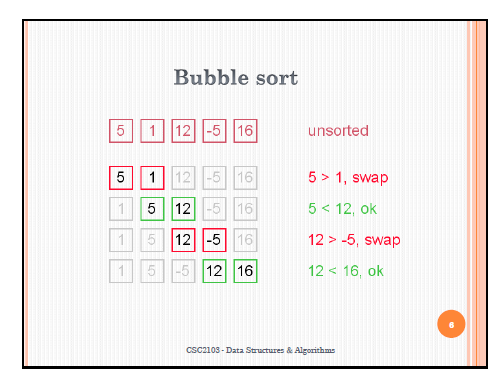

#### Properties

* **Efficiency**
  + n - 1 times through outer loop
  + Algorithm is in Θ(n^2)
* **Highly inefficient**

### Selection Sort

#### Steps

1. Find min value in list 
2. Swap with value in first position
3. Repeat
4. E.G : 

### Properties

* **Efficiency**
  + n- 1 times thorugh outer
  + n- i times through each inner loop
  + **n(n-1)/2 total inner loops**

## Insertion sort

### Steps (1 iteration)

1. Sort first element with the unsorted list and compare

2. E.G :

### Properties

* **Efficiency**
  + variable times through each inner loop
  + **(n-i)(n-1)^2**

## Shell sort

* Improved version of **insertion sort**, where diminishing partitions are used to sort data

* Uses a sequence n1, n2 , n3 ....... n(**increment sequence**)

* **When n is odd, round down. EG: 5/2 = 2 (increment sequence)**

### Steps

1. 
2. 
3. 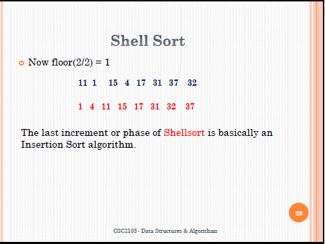

### Advantages

* 5 times faster than bubble sort
* Efficient for medium sized lists

### Efficiency

* Θ(n^3/^2)

## Divide and Conquer (Merge Sort)

Structured recursively
* Divide - Divide problem into sub-problems that are similar but smaller in size

* Conquer - Sub problems are solved **recursively,** Can be solved straightforwardly if small enough.

* Combine - Combine solutions to create solution for og problem.

### Merge Sort method 

*If list is length of 0/1, it is sorted already* Otherwise: 

* Divide unsorted list into two equal size sub-lists

* Sort each sub-lists recursively using **merge sort**

* Then, Merge sub lists back into 1 sorted list

EG : 

## Quick Sort

_Method_

* **Divide and conquer method**
* Pick an element as a pivot (usually 1st number)
* Divide list into 2 halves
  + Elements in first half is smaller than pivot
  + Elements in the 2nd half is greater than pivot

### Example & Efficiency 

Example :

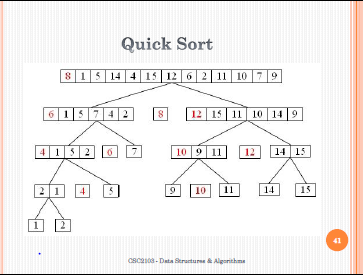

Efficiency :

* Each partition halves size of array to be sorted 
* O(n^2)

# Lesson 3 (Trees)

Trees consist of **nodes** and are connected by  **edges** and can be appllied in **file systems, orgranizational charts and programming environments**.

## Tree components

Root node - A node without a parent (start node)

Leaf node - A node wihtout children (is on its own)

Internal node - A node with >=1 child

No. of nodes in a tree = No. of edges +1

**Height** of a node in a tree = Length of longest path from that node to a leaf.

**Depth** of a node in a tree = Length of path from root to the node.

## Binary tree

Binary trees are a tree in which no node has <=2 children

### Complete binary tree / Full binary

Full

- Every node in tree **except leaves has exact 2 children**

Complete

- Binary tree where **every level (row) of tree  is complete except last level**

## Tree traversal

**3 types :**

1) preOrder (parent, left then right)
2) inOrder (left,parent, then right)
3) postOrder (left,right, then parent)

## Binary tree appliccationm (expression tree)

An expression tree = binary tree with these properties:

- Each leaf is an operand
- Root & internal nodes are operators
- Subtrees are subexpressions, root is an operator

## Binary search tree (BST)

### Properties of a BST

For a parent node X, all children in **left subtree** is smaller than node X. Children in **right subtree** is more than node X.

### Node deletion in

Deleted node is a child
-Then, remove from tree

Deleted node only has one child

- Copy child to node and then   delete child

Deleted node only has two child

- Replace key of node with minimum element in right subtree
Then delete minimum element

- E.g : 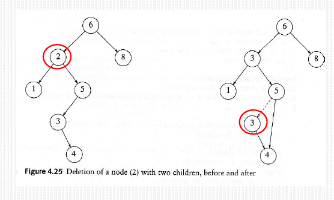

## BST disadvantages

In terms of efficiency, height of BST can be n-1. Thus, insertion and deletion and other operations can be O(N) in worst case.

Goal is to :

- Keep height of BST to O(log2 N)
- This is done by self balancing trees : AVL & red black tree

# Chapter 4 (AVL, Red-Black & M-Way tree)

## AVL trees

* Self balancing BST tree where height of left & right subtree has a difference of at most 1 row (therefore is height balanced)

* tree balancing is performed using rotations : Single & double rotation

* AVL has its advantages in **searching**

Single rotation example:
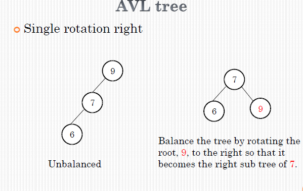

Double rotation example:
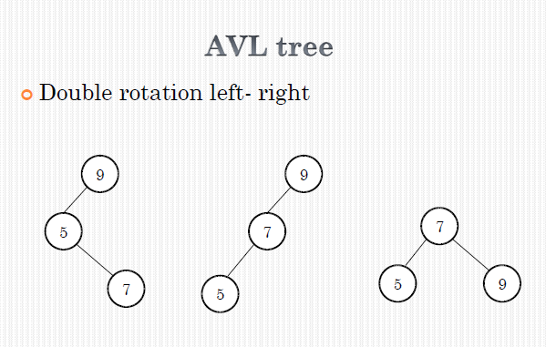

## Red-Black tree

### Remember these properties
BST tree with these properties:

* Every node is red/black
* Root **must be black**
* If a node is red, - children are black
* Path from root to any leaf must have same number of black nodes

Note: Empty(nil) nodes are **black** by default

### Look at examples from slides on insertion & deletion

# Chapter 5 M-Way tree

## Multi-Way Trees

An m-way tree is a **search tree** where each node can have 0 - m sub trees

### Properties

- Each node has m children 0 to m subtrees
- keys in each node are in ascending order
- Subtrees to left are less than the node (same as bst)
- Subtrees to right are more than the node (same as bst)

Amount of children node = m-1  
E.g:

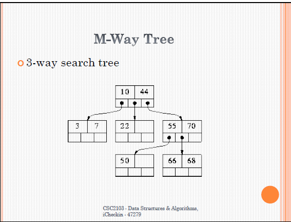

## Balanced Tree (Specialized M tree)

- M-way tree with two properties:
    * Every node in a B-Tree contains at most m children.
    * Every node in a B-Tree except the root  
    * node and the leaf node contain at least m/2 children.
    * The root nodes must have at least 2 nodes.
    * All leaf nodes must be at the same level.

Usage : Used when the data to be accessed/stored is located on secondary storage devices because they allow for large amounts of data to be stored in a node.

Eg : 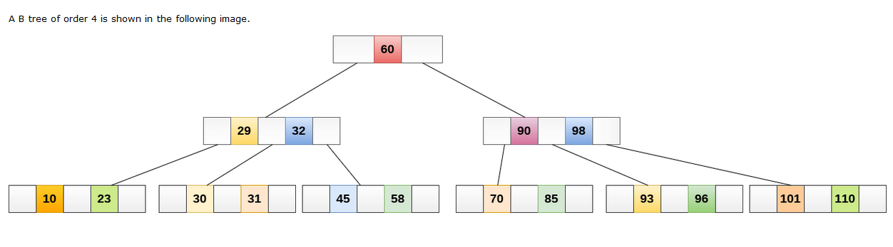

## 2-3-4 Tree

Properties:

- Every child node has 2-4 items
- All leaves of tree are same depth
- Each node has a value for the largest key in its sub tree

### Insertion

- Find location
- Insert item
- Update node:
    * Inserting into 2-item node => 3-item node
    * Insertion into 3-item node => 4-item node
    * Insertion into 4-item node => **5-item node** (invalid, must be split and update parent) **Increases height of the tree**

E.G: 

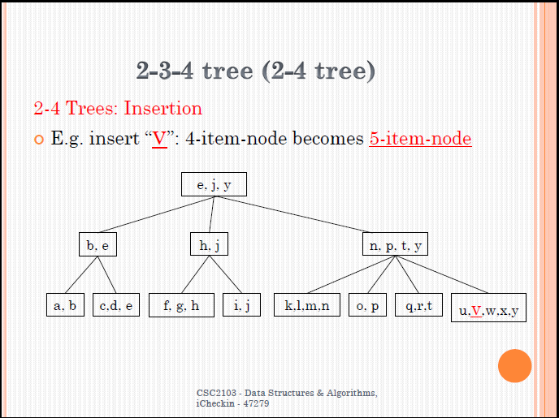

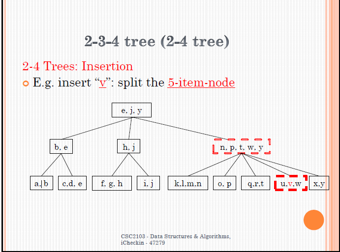

### Deletion

- Find location
- Delete the item
- Update the node
    * Deletion from a 4-item-node ⇒ 3-item-node
    * Deletion from a 3-item-node ⇒ 2-item-node
    * Deletion from a 2-item-node ⇒ 1-item-node
      * If the 1-item-node has a sibling with more than two children redistribute the children
      * If not, collapse the 1-item-node and one of its siblings into a 3-item-node and update the parent
      * This may cause the parent to become a 1-item-node
      * Fix this recursively
      * If the root becomes a 1-item-node, remove it

# Chapter 6- Stack, Queue, Linked lists , graphs and tress

## Stack (LIFO) data structure

Last in first out (LIFO) sequence of elements.

* elements are added / removed **only at the top of the stack**
* depth = no. of elements a stack has

Applcations for stack:
    * Word processing (undo function)
    * Interpreter
    * Parser

### Stack Requirements

* Must allow stack to be empty
* Must allow for push(add), peep(access topmost element) & pop(pop) functions

#### Infix & Postfix for stack

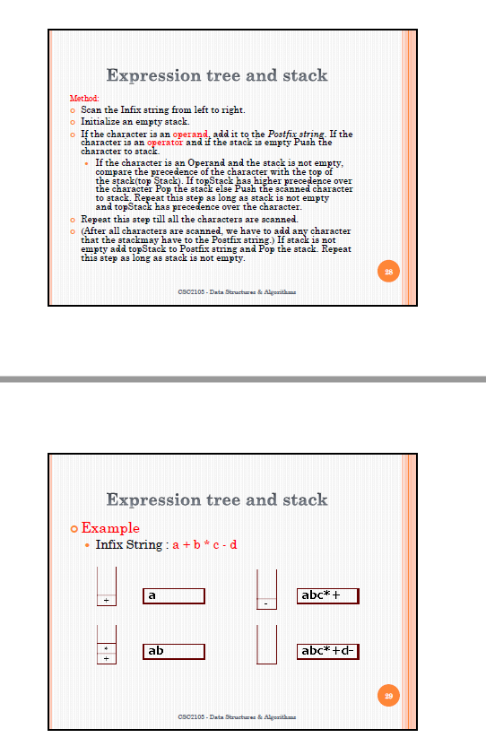

## Queues (FIFO) data structure

Data can be added on one end and retrieved from the other

Queue Operations:

* Enqueue - add element at the rear
* Dequeue - add element at the front

An Empty queue has variables (rear & front) set to 0

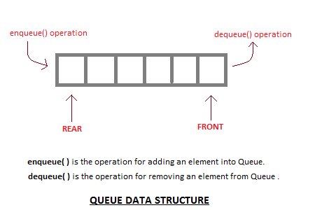

### Addition and deletion

Items are added at the rear of queue & deleted from front

> Addition:

    Empty queue: 
    
    Set both "Front" & "Rear" to 1 and place first item at array index 

    Not empty queue: 
    
    Increment "Rear" and put item at array index "Rear"

> Deletion:

    Increment "Front" 
    If "Front" > index of last item

## Linked Lists

Lists are a basic data stucture without constraints allowing for items to be deleted / inserted at any point of time

Linkes lists stores data into **nodes** and each node has **pointer** referencing to the **next node** 

* Additional pointer to point to **first node** & pointer points to **NULL**

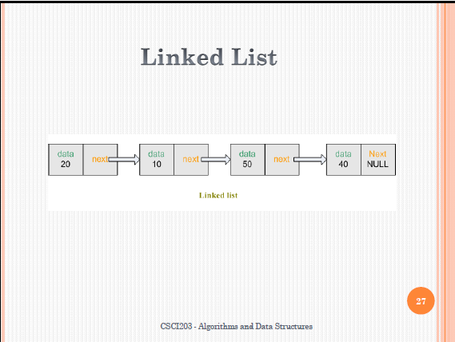

### Advantages 

1) Can be dynamic in size
2) Easier to insert/delete compared to arrays

### Disadvantages

1) Random access is not allowed. We have to access elements sequentially starting from the first node. So we cannot do binary search with linked lists efficiently with its default implementation.

2) Extra memory space for a pointer is required with each element of the list.

3) Not cache friendly. Since array elements are contiguous locations, there is locality of reference which is not there in case of linked lists.

## Graphs

Set of **nodes(vertices)** connected by **edges(arcs)**

* Can be directed/undirected (arrows or no)

### Adjacency Matrix 

e.g:

