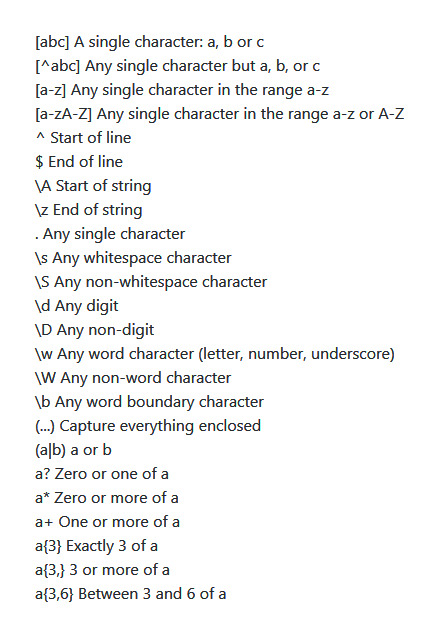

# Web Programming Finals Revision

## prag_match cheatsheet 




## Static vs Dynamic Content 

| Static                            | Dynamic                                                            |
|-----------------------------------|--------------------------------------------------------------------|
| Stored on webserver               | Generated by computer program                                      |
| Retrieved via HTTP protocol       | Retrieve info from a database (respond to user input: e.g web form |
| Displayed to client via a browser | Converted to HTMl and retrieved via HTTP (by user's browser)       |


## Chapter 1 - Server Side & Client Side Languages

Server Side vs Client Side

| Server Side                                              | Client Side                                         |
|----------------------------------------------------------|-----------------------------------------------------|
| Implemented & Executed on a web server                   | Implemented & Executed on user's browser (frontend) |
| E.g languages: PHP, JSP, ASP, Java Servlet, Perl, Python | Javascript                                          |

**Java** can be used as a **server side** / **client side** language 

Server side - Java Servlets
Client Side - Applets/ Swing

### How server side works

1) A user requests for a website in the browser. (Sends request URL)

2) This request is then sent through the Internet to find where the website lives on (server/computer)

3) Web Server responds to this request by sending some files back to the client

4) Before being sent, sample files such as html and php code will be interpreted with an interpreter and then sent over 

5) The content will then be displayed on the client's web browser

# Chapter 2 - PHP Basics

### Local Variable  & Global Variable Declaration

```php
<?php

$firstname = "David"; //Global Variable

function TestFunction(){
    //Global variable can be accessed using global keyword
    global $firstname;
    $testlastname = "Chow"; // Local variable
    $fullname = $firstname . " ".  $testlastname;

    echo $fullname;
}

TestFunction();

?>
```

Global variables are stored in an array and can be called using $GLOBALS[index]

```php

<?php 
$a = 1;
$b = 2;

function testfunction(){
    // Global variables can be updated as so
    $GLOBALS["a"] = $GLOBALS["a"] + $GLOBALS["b"];
}

testfunction();
echo $a;
?>
```

## Arrays 

3 types:

1) Numeric
2) Associative
3) Multidimensional

Numeric 

```php
<?php

$cars = array("Myvi","Honda","Kancil");

echo $cars[0] . "and" . $cars[1];

?>

Output:

Myvi and Honda
```

Associative Arrays 
```php
<?php 

$ages["Peter"] = 18;
$ages["Sam"] = 20;

echo "Peter is"  .ages["Peter"] . "years old"
?>

Output: 

Peter is 18 years old
```

Multi-dimensional arrays
```php

<?php
$characters = array(
                array(
                    "name" => "Jack",
                    "Occupation" => "CEO"
                ),
                array(
                    "name" => "Axton",
                    "Occupation" => "Merc"
                )
            );

foreach ($characters as $c){
    while (list ($k,$v) = each ($c)){
        echo "$k $v <br/>";
    }
}


Output: 
name : Jack
Occupation: CEO
name: Axton
Occupation: Merc
```

## Functions

Simple syntax 

```php
<?php

function writeName(){
    echo "David Chow"
}

echo  "My name is: ";
writeName();
?>

```

# Chapter 3- Forms

## Get vs Post method

### Post

* Data is sent with the page request in the page Headers
* URL is unchaged
* Page then requires a resubmit if refreshed

### Get

* URL is changed as form data is submitted into URL
* Each field name of the form will be dispalyed
    * e.g: form.htm?name=David&Age=21
    * ? = indicated start of a query
    * & = separator of fields in query string

## When to use GET & POST

GET
* Should only be used for nonsensitive information 
* As variables of form is saved into URL, could be useful to bookmark it later

POST
* Should be used to hide sensitive information
* Information sent is invisible ot others


# Chapter 7 -Cookies & Session

## Cookies

* Small piece of information stored as a file in the **browser**
* When created, cookie is sent to web server as header info
* Limited in size (1kb)

### Usage
1) Store information when user visits a page
    * What pages the user has visited
    * Store basic information (first visit etc)
    * Store number of visits

### 2 Types of Cokies

1) Session Cookie
    * Cookies are temporary and expire when session/browser ends
2) Persisten Cookie
    * Only expires after given time

Example

```php 
<?php

setcookie("username", "dc", time() + 3600); 

?>
```


## Sessions

Sessions are started using session_start();

* Stored on **web server** (more secure)
* To store information accessible across web pages
* Not limited in size
* Uses **HTTP** protocal (stateless) 
    * Browser can remember what actions a user has done 


### Session state

* Server-based state mechanicsm that allows web appplications to store & retrieve objects unique to each user session
* **ideal for storing more complex data** of a user session


## Cookies VS Session 

| Cookies                                          | Session                                                   |
|--------------------------------------------------|-----------------------------------------------------------|
| Stored in **browser** as text file format        | Stored in **web server**                                  |
| Limited in size                                  | Unlimited in size                                         |
| Only allows for 4kb of data                      | Allows for multiple variables in a session                |
| Holds variables in **cookies**                   | Holds variables in **sessions**                           |
| Cookies can be accessed easily (**Less secure**) | Session values can't be accessed easily **(More Secure)** |
| Set Cookie time to destroy cookies               | Use session_destroy() to destroy sessions                 |
| setcookie()                                      | session_start()                                           |


# Chapter  9 - Localization

## Internationalisaiton

Ensuring that an application can adapt to local requirements (language & cultural barriers)

* Translation of content

## Localisation

* Adaption of language, content & design to reflect a culture
    * 1 application for multiple regions
    * Support correct formats for date,time & currency
    * Weights & measurements
    * Telephone no. & addresses

### Components

* Language
    * Avoid images to display text
* Pictures
    * Avoid infringing copyrights & offending culture & religion
* Symbols
    * Use apropriate symbols (flags,currency,language)
* Colors
* Navigation
    * Some cultures read from right to left and vice versa
* Content


# Chapter 10 - AJAX

AJAX = Asynchronous Javascript & XML 

* Development technique for creating interactive web applications
* JavaScript(XMLHttpRequest) is used to send & receive data between a **web browser** and **application**

Ajax uses  **XMLHttpRequest** **(AKA JAVASCRIPT)** to 
* Send data **to a web server** & XML is used as the format for **receiving server data**

| XMLHttpRequest (JavaScript)          | XMl                                   |
|--------------------------------------|---------------------------------------|
| Send and exchange data witha  server | Used as format to receive server data |

Ajax applications are **browser & platform independent**

## How it works

1) User sends a request from the UI and a javascript call goes to XMLHttpRequest object.

2) HTTP Request is sent to the server by XMLHttpRequest object.

3) Server interacts with the database using JSP, PHP, Servlet, ASP.net etc.

4) Data is retrieved

5) Server sends XML data to XMLHttpRequest (JavaScript) callback funciton

6) HTML & CSS is then displayed on browser


## Advantages

* Interactivity
    * Asynchrnous trasmission (back & forth)
* Bandwidth usage
    * Small payload
* Encourages modularization 
    * Function ,data sources, structure & style
* Allows non-related technologies to work together (server-side languages , databases, client-side languages)
    

## Disadvantages

* Difficult to debug as it is **asynchronous**
* Search engines can't index/optimize
* Back Button / bookmarks may not work as expected
* May experience response time /latency problems if too many frequent updates

## Ajax Application

* Real time form validation 
    * When server side info is needed
* Autocompletion
* Sophiticated U.I controls & effects
    *E.g: Progress bars
* **Getting data without reloading**


